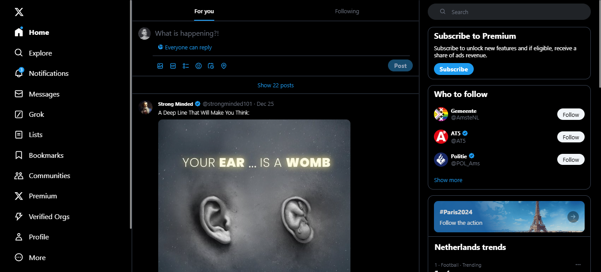
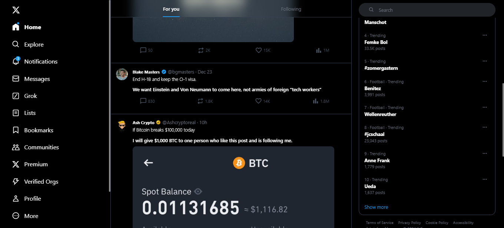
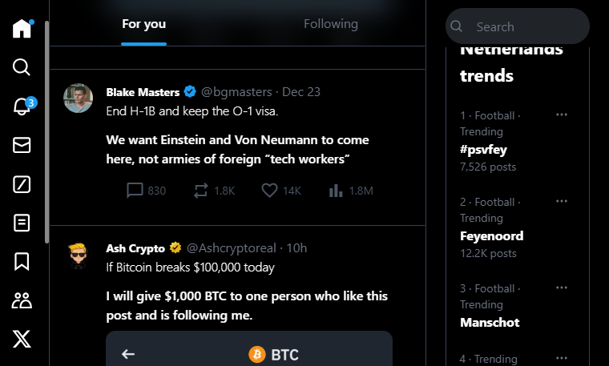

# X - Twitter UI Clone

## *WEBSITE DEMO*

## A Simple UI Clone!

#### This web page is hosted [here!](https://radins-x.netlify.app/)

- View the local installation in the [CONTRUBUTING.md](https://github.com/RaDins-18/X-Twitter-UI-Clone-Using-Tailwind/blob/main/CONTRIBUTING.md).

### *Features*:

* User-friendly
* Responsive, on all devices
* Miner details

### *Features to be added*:

Check [Issues](https://github.com/RaDins-18/X-Twitter-UI-Clone-Using-Tailwind/issues) for contributing to this repository.

* Dynamic Posts: Get posts dynamically.
* Functionality: Make it functional.
* Login Features (use APIs) & Database: So the website can be opened on any device, users can log in, and the posts can be viewed anywhere, anytime.

# *Contributions*

- All contributors are most welcome! This is definitely open source!
- View the [`CONTRIBUTING.md`](https://github.com/RaDins-18/X-Twitter-UI-Clone-Using-Tailwind/blob/main/CONTRIBUTING.md) for further instructions, requirements/dependencies & local project setup instructions!

# *Author*

* RaDins (radinofficial15@gmail.com)
  - [Instagram](https://www.instagram.com/radinsterritory/)
